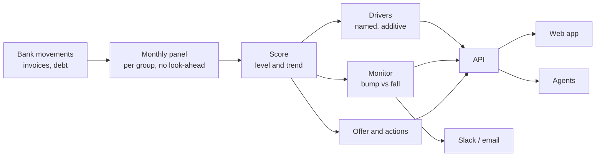
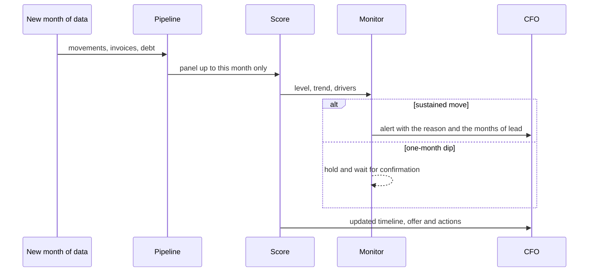

<div align="center">

<picture>
  <source media="(prefers-color-scheme: dark)" srcset="docs/brand/lockup-embat-lighthouse-dark.svg">
  
</picture>

<br/><br/>

**See where a company is heading, not only where it stands.**

A financial health score read from a company's money trail,
and a product a CFO can act on built on top of it.

`HackSpain 2026` · `Embat challenge` · `Madrid`

**[Open the live demo](https://lighthouse-1qeo.onrender.com)**

</div>

> **Disclaimer.** All data is synthetic. Groups are labelled with the names of real companies only
> to make the demo readable: every score, figure and alert under a name is invented and says
> nothing about the real company.

---

## Why a lighthouse

A lighthouse does not describe the ship. It shows the coast early enough to change course.

Most credit and health signals are snapshots: annual accounts that arrive late, ratings refreshed
once in a while. Two companies can sit at almost the same score today and be completely different
risks, because one is climbing and the other is sliding.

```
score
 100 ┤
  82 ┤ ●╮                                   Company A   82 → 68
     │   ╰──╮
  68 ┤       ╰────────────────────────●     three points apart today.
  65 ┤       ╭────────────────────────●     One is a far better bet,
     │   ╭──╯                               and a snapshot cannot tell which.
  45 ┤ ●╯                                   Company B   45 → 65
   0 ┼────────────────────────────────
     M1      M6      M12     M18    M24
```

Lighthouse reads the **trajectory**, in **both directions**, **before** it is obvious, and says **why**.

## What it answers

For every business group, every month:

| | Question | What you get |
|---|---|---|
| 1 | **Who is healthy?** | A 0 to 100 level, not only a list of who is in trouble |
| 2 | **Who is improving?** | Upward trajectories, often the best opportunities in a portfolio |
| 3 | **Who is starting to bend?** | Early deterioration while the level still looks fine |
| 4 | **Bump or fall?** | One bad cash month told apart from structural decline |
| 5 | **Why did it change?** | The named drivers that moved, and when |
| 6 | **When was it visible?** | How many months ahead the signal appeared, measured |

## The product

The score is the engine, not the deliverable. The buyer is the CFO who already has their treasury
data in Embat: the data is there, the question is what it means.

> *"What will my bank think of me in three months, and what do I do about it this week?"*

| Layer | What the CFO sees |
|---|---|
| **Monitor** | An alert when the score really moves, and silence on a one-month dip |
| **Explanation** | The score timeline, the drivers behind each move, which subsidiary weighs on the group |
| **Offer** | A working-capital line whose limit and price follow the score every month, in both directions |
| **Actions** | A short ranked list of moves, each tied to a driver and its expected effect |
| **Agents** | Assistants that narrate the score in plain language and add public and sector context |
| **Backtest** | The history replayed month by month, showing how early each signal was visible |

## How it works



Every month of new data flows through the same path, so the product can be replayed live:



### Principles

- **Trajectory over snapshot.** Every view shows where the group is heading.
- **No unexplained number.** Anything on screen decomposes into named drivers. No black box.
- **Both directions count.** Improvement is as valuable a signal as deterioration.
- **No look-ahead.** A month is scored only with what was known that month.
- **Portable.** A group scores the same alone as inside a portfolio, so it works on companies it has never seen.
- **Measured, not claimed.** Discrimination, stability and anticipation are validated on groups held out entirely.

## Quickstart

Requires [uv](https://docs.astral.sh/uv/), Python 3.12+ and Node 20+ for the web app.

```bash
# drop the nine dataset CSVs into data/raw/, then
make lighthouse              # everything: install, load, score, publish, API on :8000, web on :5173
make lighthouse RAW_DIR=output   # same, with the CSVs somewhere else
```

One command, a few minutes the first time (npm install and 615 MB of CSV), about fifteen seconds
after that. Ctrl-C stops the API and the web together; `make lighthouse-down` stops them from anywhere.
An API or web already running on its port is reused, not fought over. With it running, a second terminal feeds
the months in live: `make replay FROM=2025-01 PAUSE=8` on the challenge data, or
`make demo` to watch 24 named Spanish scale-ups connect to the platform in two arrivals, scored on the spot beside them.

Piece by piece:

```bash
make install                 # Python dependencies
make web-install             # front end dependencies
cp .env.example .env         # optional: Slack webhook, SMTP, CORS origins, port

make api                     # API on http://localhost:8000 (OpenAPI at /docs)
make web                     # web app on http://localhost:5173
```

The repo ships the serving tables the demo reads, so the two commands above are enough to open it.
To rebuild from a raw dataset, drop the CSVs into `data/raw/` (or pass `RAW_DIR=`) and run:

```bash
make panel                   # raw CSVs -> monthly panel per group
make validate                # score it and measure it, split by group
make monitor                 # detect sustained moves, write the alert feed
make serve                   # write the tables the API reads
make submit RAW=path/to/csvs # score a dataset the system has never seen
make replay FROM=2025-01     # live mode: a month lands every few seconds
make demo GAP=20             # 24 named synthetic scale-ups connect in two arrivals, on top of the portfolio (make serve restores the tables)
```

`make help` lists every target. `make ci` runs what must pass before pushing.

## Repo layout

```
src/xray/
  pipeline/        raw data -> monthly panel per group
  scoring/         score, trend, monitor, explanation, offer, serving tables
  agents/          narrator, research and sector agents around the score
  integrations/    outbound clients (Slack, email)
  api/             FastAPI backend, one router per resource
web/               front end (Vite + React + TypeScript)
tests/             mirrors src/xray
notebooks/         exploration only
docs/              brief, architecture, infrastructure, brand
```

The package keeps its working name, `xray`. Dependencies point one way:
`pipeline` ← `scoring` ← `agents`, `api`. The API reads precomputed tables and never runs the pipeline.

**Stack:** Python, DuckDB and Parquet, FastAPI, React, Docker, deployed on Render.

## Data

The challenge dataset is fully synthetic: around 1,300 companies in 250 business groups over 24 months
of bank movements, invoices and financing products. No row corresponds to a real company, account or
person. The names shown on groups are real company names used as labels over synthetic data (see the
disclaimer above). The raw dataset is not distributed here.

---

<div align="center">
<sub>Built over one weekend at HackSpain 2026 for the Embat challenge.</sub>
</div>
