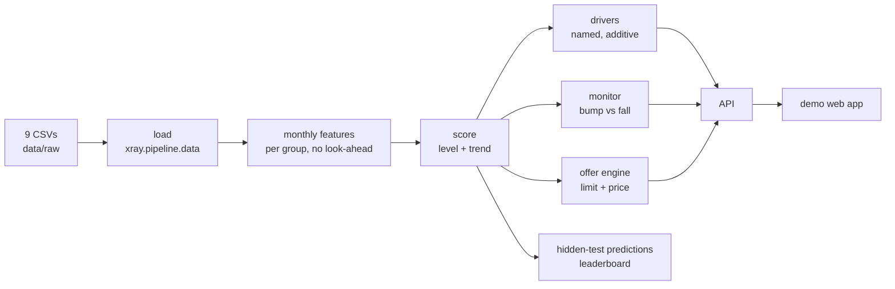

<div align="center">

# 🩻 X Ray

**Can money tell you how a company is doing?**

A financial health score read from a company's money trail,
and a product a CFO would actually pay for on top of it.

`HackSpain 2026` · `Embat challenge` · `18–20 Sep · ETSIT UPM, Madrid`

</div>

---

## The problem in one chart

```
score
 100 ┤
  82 ┤ ●╮                                   Velasco Industrial   82 → 68
     │   ╰──╮
  68 ┤       ╰────────────────────────●     three points apart at M24.
  65 ┤       ╭────────────────────────●     One is a far better risk,
     │   ╭──╯                               and today's snapshot can't tell which.
  45 ┤ ●╯                                   Northbrook Foods     45 → 65
   0 ┼────────────────────────────────
     M1      M6      M12     M18    M24
```

Everyone looks at snapshots: late accounts, ratings refreshed once in a while.
X Ray reads the **trajectory**, in **both directions**, **before** it is obvious, and says **why**.

## What we are building

> Working thesis. Revisit once we have seen the data and the leaderboard metric.

**Buyer:** the CFO already using Embat. Embat holds the data, so there is zero acquisition cost.
**Pitch:** *"What will my bank think of me in three months, and what do I do about it this week?"*

| Layer | What the CFO sees | Rubric it covers |
|---|---|---|
| **Monitor** | An alert when the score *really* moves, and silence on a one-month dip | Monitor, stability |
| **Explanation** | Score timeline, which drivers moved and when, which subsidiary drags the group | Explanation, trajectory |
| **Offer** | A working-capital limit and price recalculated monthly from the score. Up when improving, tightening early when bending | Product, both directions |
| **Actions** | Three ranked moves, each tied to a driver with its expected score impact | Product, buyer |
| **Backtest** | "Detected N months before it showed in the level", replayed over the 24 months | Anticipation, measured |

Embat's upside: ARPU expansion on existing customers, plus an origination fee from partner lenders.

## The six questions

Per group, per month, the system must answer:

1. **Who is healthy**, not only who is in trouble
2. **Who is improving**: 45 → 65 can be next year's best bet
3. **Who is starting to bend**: 82 → 68 still looks fine
4. **Bump or fall**: a bad cash month vs structural decline
5. **Why it changed**: which signal moved, and when
6. **When it was visible**: how many months ahead

## Architecture



## Quickstart

Requires [uv](https://docs.astral.sh/uv/) and Python 3.12+.

```bash
make install     # uv sync + nbstripout git filter
# drop the dataset CSVs into data/raw/  (or set XRAY_DATA_DIR)
make inspect     # shape, columns and dtypes of every table found
make test
make quality     # ruff check + format check
make format

make panel       # raw CSVs -> parquet -> monthly panel per group, no look-ahead
make validate    # score it and measure: discrimination, trajectory, stability, ablation
make monitor     # detect the jumps and the sustained shifts, write the alert feed
make alerts      # show what the monitor would send, send nothing
make serve       # write the real serving tables to data/serving
make submit RAW=path/to/hidden   # score a dump the system has never seen
make replay FROM=2025-01 PAUSE=8 CHANNEL=slack   # live: a month lands every 8 s, web and Slack follow

cp .env.example .env   # optional: Slack webhook, SMTP, CORS origins, port
make api         # API with reload on http://localhost:8000 (docs at /docs)
make api-up      # same API in Docker, reads data/serving/*.parquet
make slack-test  # send a test alert to the Slack webhook
make notify MONTH=2026-05   # replay one month of alerts into Slack
```

To inspect the provisional baseline scores locally, run `make score-baseline`, then `make api`, and open
[the internal viewer](http://localhost:8000/viewer). It reads `data/marts/real_scores.parquet`
and `real_drivers.parquet`; the invented `DEMO_*` serving data is not shown there.

## Repo layout

```
src/xray/
  config.py        paths and table names
  settings.py      runtime settings from .env (XRAY_ prefix)
  pipeline/        raw CSVs -> parquet -> monthly panel (data, clean, cash, panel, lake, replay); the only place pandas is imported
  scoring/         score, trend, monitor, explain, offer, serve, submit: reads the panel, writes data/serving
  agents/          research, macro and narrator agents around the score, tools under agents/tools
  integrations/    outbound clients, one module per service (slack)
  api/             FastAPI demo backend, one router per resource in api/routers
web/               demo front end (Vite + React): `make web-install`, then `make web`
tests/             mirrors src/xray: tests/pipeline, tests/api, tests/agents
notebooks/         exploration only; `01_eda.ipynb` is published with its outputs on purpose
data/raw/          the dataset (git-ignored)
data/processed/    derived tables (git-ignored)
data/serving/      parquet written by `make serve`, read by the API (tracked: the deployed API bakes it in)
docs/              brief, architecture, scoring (as built), score research, serving contract, infra, agents, status
.claude/rules/     coding, testing, API and commit conventions
```

Dependencies point one way: `config`/`settings` <- `pipeline` <- `scoring` <- `agents`, `api`.
The API never imports `pipeline` (no pandas in the container, see `docs/infra.md`).

Infrastructure, Docker, `.env` and CI are explained in [`docs/infra.md`](docs/infra.md). How the score is computed, exactly, is [`docs/scoring.md`](docs/scoring.md); the research behind it is [`docs/health-score-research.md`](docs/health-score-research.md).

## The score in one paragraph

Nine ratios read from the money trail, each over a trailing window: cash buffer in days of operating outflow, months overdrawn, six-month operating margin, run rate against the trailing year, amount-weighted days late and overdue months on payables and on receivables, debt service over inflow. Each maps to 0-100 through fixed published anchors, then into five pillars and one level with weights liquidity 0.40, payment discipline 0.20, cash generation 0.20, collections 0.10, debt burden 0.10. Nothing is fitted and nothing reads a population statistic, so a group scores the same alone as inside the portfolio. Direction and state come from a causal CUSUM on the smoothed level. Held out by group, the level separates forward negative cash at AUC 0.906 (51.0% in the bottom quintile, 0.6% in the top) and moves a median 2.7 points a month.

## Dataset

1,286 synthetic companies in **250 business groups**, 24 months each (Sep 2024 → Sep 2026). Fully synthetic.

| File | Contents |
|---|---|
| `groups.csv` | One business group per row, 1–24 companies each (median 2) |
| `companies.csv` | Group, country, currency, ERP, signup date. `company_id` joins everything |
| `banking_products.csv` | Accounts: current, card, POS, savings, investment, expense platform |
| `debt_products.csv` | Loans, leasing, credit lines, factoring, confirming… granted and outstanding |
| `debt_schedule_config.csv` | Amortization terms: installments, frequency, rate, next payment |
| `transactions.csv` | 24 months of bank movements with category, counterparty, concept |
| `invoices.csv` | Issued and received: issue, due, paid date, pending amount, status |
| `balances.csv` | Balance per account and product at 1 Sep 2026, the final snapshot |
| `data_dictionary.md` | Every field explained. Read it first |

## Modelling guardrails

- Score the **group**. Split train/validation **by group**, never by row or month.
- **No look-ahead**: a feature for month `t` uses data up to `t` only. `balances.csv` is month-24 information.
- Every score decomposes into **named drivers**. No black box.
- Separate **level** from **trend**, and a **dip** from a **sustained move**.

## Roadmap

**Engine**
- [x] Project scaffold, loaders, tooling
- [x] Data audit: traps in `docs/architecture.md` 6; target and metric still unknown (`docs/brief.md` Q1)
- [x] Monthly feature table per group
- [x] Anchored score + group-wise validation, AUC 0.906 held out
- [ ] First leaderboard submission (`make submit` runs; format lands with the scoring script)
- [x] Driver decomposition (why, and what moved since last month)

**On time**
- [x] Bump-vs-fall logic (jumps resolve to sustained or reverted)
- [x] Monitor that fires on its own (Slack or email)
- [x] Anticipation measured: median 6 months before first negative cash, 4 before the tier moves

**Worth something**
- [x] Offer engine: score → limit and price
- [x] Ranked actions with expected score impact
- [ ] API + navigable demo, deployed on the real tables
- [ ] Pitch rehearsed: five minutes, `GROUP_0043` vs `GROUP_0220` as the opener

## How we are judged

Three equal blocks: **is it right** · **is it on time** · **is it worth something**.
A simple model with a clear product beats a sophisticated one that stops at the number.
The demo counts as much as the product.

---

<div align="center">
<sub>Built over one weekend. All data is synthetic: no real company, account or person.</sub>
</div>
