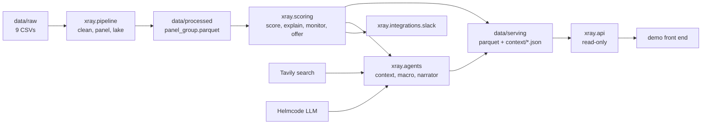

# Architecture

How the system is laid out, how raw CSVs become the monthly panel everything else reads, how the
agents add public context around the score, why each part is built this way, and where it stops
being the right answer. Read `docs/brief.md` first for what we are building.

## 1. System shape

Four stages, each one a package, each one reading only what the stage before it wrote.



| Package | Job | Runs | Talks to the network |
|---|---|---|---|
| `xray.pipeline` | raw CSVs to parquet to the monthly panel | batch, `make panel` | no |
| `xray.scoring` | level, trend, drivers, monitor, offer, serving tables and the hidden-test submission, over the panel. Formulas in `docs/scoring.md` | batch, `make serve`, `make submit` | no |
| `xray.agents` | public context, macro and narrative around a score | batch or on demand, cached | yes: search and model |
| `xray.integrations` | outbound clients, one module per service | called by scoring | yes: Slack |
| `xray.api` | serves `data/serving` to the demo | long-running container | no |

Two rules hold the shape together:

- **Dependencies point one way**: `config`/`settings` <- `pipeline` <- `scoring` <- `agents`, `api`.
  Nothing imports from a stage to its right.
- **Everything the demo shows is precomputed into `data/serving`.** The API never calls the
  pipeline, the model or the web during a request. It imports no pandas, so its image stays small
  and it cannot fail on stage because a third party is slow.
  The one exception is the Agents chat (`POST /api/v1/chats`): it plans, searches and writes
  during the request. It is a separate tab, so when the model or the network is slow the rest
  of the demo is untouched.

Runtime configuration is `xray.settings` (environment, `XRAY_` prefix, see `docs/infra.md`).
Paths and dataset constants are `xray.config`.

## 2. The size of the problem

Measured on the real dataset, on one laptop.

| | |
|---|---|
| Raw CSVs | 615 MB (transactions 450, invoices 165, the other seven under 2) |
| Rows | 3.46 M (tx 2,556,437 · inv 897,894 · rest 17,885) |
| `transactions.csv` to parquet, DuckDB | 0.5 s, 450 MB down to 108 MB |
| Full clean step, pandas | 9 s |
| Panel build, DuckDB | 0.7 s |
| Output | 6,000 group rows, 30,864 company rows |

A full rebuild from raw CSV takes about ten seconds. That single fact decides most of what
follows: there is no incremental loading, no orchestrator, no scheduler and no database server,
because none of them would save time worth having.

## 3. Data pipeline

Three layers, each reading only the one above it. A table never reaches across a layer.

| Layer | Directory | Built by | Holds |
|---|---|---|---|
| raw | `data/raw` | nobody, never modified | the nine source CSVs |
| staging | `data/processed` | `xray.pipeline.clean` | one parquet per source table, cleaned and typed |
| marts | `data/marts` | `xray.pipeline.cash`, `.panel` | business-facing tables, plus `_lineage.json` |

```
data/raw/*.csv
   |
   v  xray.pipeline.clean    pandas, one pass, fixes the traps in section 6
data/processed/*.parquet     staging: same grain as the source
   |
   +--> xray.pipeline.cash   rolls balances.csv back into a monthly series
   |      cash_monthly.parquet       1,266 x 24
   |
   v  xray.pipeline.panel    duckdb, as-of aggregation, consumes cash_monthly
panel_company.parquet        1,286 x 24
panel_group.parquet            250 x 24   <- the contract
   |
   v  xray.scoring.score     indicators -> anchors -> pillars -> level, per group (and per company)
scores.parquet                 4,114 covered group-months
   |
   +--> xray.scoring.monitor  trend, states, jumps and shifts        alerts.parquet, trajectory.parquet
   +--> xray.scoring.serve    + explain, offer                       data/serving/*.parquet
   +--> xray.scoring.submit   same chain over a hidden-test dump     predictions_*.csv
```

`docs/scoring.md` is the reference for everything under `scores.parquet`.

`make panel` runs it. Make tracks the file dependencies, so an unchanged raw dump rebuilds
nothing and a touched `clean.py` rebuilds from there down.

### Lineage

Every mart table has an entry in `data/marts/_lineage.json` naming the tables it was built from,
the commit that built it, when, and its shape:

```json
"cash_monthly": {
  "built_at": "2026-09-19T08:14:02+00:00",
  "git_commit": "8b72f12",
  "sources": ["balances", "banking_products", "transactions"],
  "rows": 30384,
  "columns": ["company_id", "month", "cash", "n_cash_accounts", "cash_is_extrapolated"]
}
```

So a number on a chart can be traced to the files behind it without reading the code.

## 4. Parquet is the system of record, DuckDB is a query engine

Never persist a `.duckdb` file. `duckdb.connect()` opens in memory, reads parquet, writes parquet,
closes.

This is not a detail, it is the design. A DuckDB file held open read-write takes an exclusive lock
on the whole database, and a second process is refused even when it asks for read-only:

```
second writer:      IO Error: Could not set lock on file
concurrent reader:  IO Error: Could not set lock on file
```

So the obvious layout, an API container serving from `xray.duckdb` while a build job writes to it,
deadlocks. Keeping state in parquet removes the problem instead of working around it: writers
append files, readers open them, the two never meet.

The rest of the honest case against DuckDB, since we are betting on it:

- No network protocol, no auth, no connection pool. It is embedded, like SQLite, and will not
  become a server.
- No time travel, no CDC, no schema evolution. Delta and Iceberg have those; this does not.
- The storage format is tied to the DuckDB version, which is another reason not to ship a
  `.duckdb` file in an image. Parquet has no such coupling.
- Single node. Irrelevant at 3.46 M rows, relevant to any claim we make on stage.

What it buys, against those: it parses the quoted multi-line CSV correctly, does the whole
join-and-aggregate in under a second, needs no service in the compose file, and leaves the output
readable by pandas, polars or R without anyone reading our Python.

Alternatives weighed and rejected: **Postgres** solves concurrency we do not have and costs a
service plus migrations; **SQLite** is single-writer too and a row store; **Spark, ClickHouse,
Airflow** are for problems two orders of magnitude larger than this one.

## 5. The panel contract

`data/marts/panel_group.parquet`, one row per `(group_id, month)`, 6,000 rows, 24 months from
2024-09 to 2026-08. `panel_company.parquet` is the same schema keyed by `company_id`.

Every value is computed from data at or before that month's last day. A row is what the system
knew at the end of that month.

| Column | Type | |
|---|---|---|
| `group_id`, `month` | str, datetime | Keys |
| `n_companies` | int | Companies in the group |
| `n_currencies` | int | Distinct company currencies; totals mixing currencies need review |
| `has_erp` | bool | The group had issued an invoice by this month |
| `is_covered` | bool | At least one transaction this month |
| `months_observed` | float | Covered months so far |
| `n_tx`, `n_counterparties` | float | Bank activity |
| `cash` | float | Reconstructed closing balance, checking and saving only. Null when unknown |
| `has_cash` | bool | A cash account was found. False for 20 companies, 480 rows |
| `runway_months` | float | `cash / outflow`. Negative when overdrawn, null when `has_cash` is false |
| `cash_is_extrapolated` | bool | Month precedes the first cash-account movement, so cash is a flat estimate |
| `inflow`, `outflow`, `net_flow` | float | Money in, out, and the difference |
| `operating_inflow`, `operating_outflow`, `uncategorized_amount` | float | Flows from explicit operating categories, and unclassified volume kept separate |
| `salary_outflow`, `tax_outflow`, `debt_repayment_outflow`, `fee_outflow` | float | Outflow by category |
| `interest_outflow` | float | Interest charges from the explicit category |
| `inflow_3m`, `net_flow_3m`, `inflow_mom` | float | Trend, not level |
| `inflow_cover` | float | `inflow / outflow` |
| `ar_open`, `ap_open` | float | Receivable and payable still open at month end |
| `ar_overdue`, `ap_overdue` | float | Of those, past due |
| `ar_overdue_90d`, `ap_overdue_90d` | float | Of those, due within the last 90 days. The score uses these: the uncapped book drifts towards all-overdue because unpaid rows never close |
| `ar_overdue_ratio`, `ap_overdue_ratio` | float | Overdue over open |
| `ar_late_days`, `ap_late_days` | float | Amount-weighted days beyond due on invoices settled that month, floored at zero per invoice |
| `ar_days_late`, `ap_days_late` | float | `ar_late_days / ar_collected`, `ap_late_days / ap_paid` |
| `ar_collected`, `ap_paid` | float | Settled during the month |
| `ar_late_days`, `ap_late_days` | float | Amount-weighted positive days beyond due date, summed over settled invoices |
| `dso_days`, `dpo_days` | float | Value-weighted days to settle |
| `n_invoices_issued`, `n_invoices_received` | float | Invoice counts |

The ERP block is null or zero for the 83 groups that never file an invoice, and for any group
before its first one. Check `has_erp` before using it; do not impute across that boundary.

`ar_collected_days` and `ap_paid_days` are the weighted numerators behind `dso_days` and
`dpo_days`. They are in the file so a group's DSO stays weighted by invoice value when companies
roll up, rather than becoming an average of averages. Ignore them otherwise.

### Cash, and why recovering it is not a leak

`balances.csv` is one snapshot at 2026-09-01. Dropping it would throw away the most intuitive
health signal there is, so `xray.pipeline.cash` rolls it back instead:

```
cash(product, t) = balance(2026-09-01) - flows after t
```

Measured on the real data, the reconstruction holds up: 1,266 of 1,286 companies, median cash flat
near 90k across all 24 months, implied negative balances falling smoothly from 9.6% to 2.6%. No
drift, no blow-up. Runway spans 0.01 months at p10 to 5.0 at p90, so there is real discrimination
in it.

This reads like a leak and is not one. `cash(t)` is the balance that actually stood at month `t`;
later transactions recover that fact rather than describe it with hindsight. Contrast
`invoices.status`, which is a real leak because it stamps July's value onto a March row. The
practical consequence is that the truncation test does not constrain `cash`, so it is checked
separately in `tests/pipeline/test_cash.py` against a hand-built series.

Two limits, both flagged in the data rather than hidden. Before a company's first cash-account
movement the series is flat at the implied opening balance, marked by `cash_is_extrapolated`,
which is 27.8% of company-months. And the roll-back uses cleaned transactions, so the level
carries a small error from the rows `clean.py` drops. Ranking within a month is unaffected, which
is what the score uses. Twenty companies have no cash account at all: their `cash` is null and
`has_cash` is false, never zero, because "no account" and "no money" must not look alike to a
score.

Only checking and saving accounts count. Cards are a liability, and TPV accounts sweep to zero and
reconstruct 100% negative.

### Still not in the panel, on purpose

`debt_products.outstanding` and `debt_products.granted` are snapshots with no dated movements
behind them, so they cannot be rolled back the way balances can. They describe month 24 and
nothing else. Debt behaviour enters through the dated `debt_repayment` transaction category
instead. Use the snapshots only for a month-24 view, and label it as such.

## 6. What cleaning has to fix

Each of these silently corrupts the score.

**`payment_date` is a placeholder on unpaid invoices.** It equals `due_date` on 96.3% of
`overdue`, 98.3% of `pending` and 98.6% of `payment_in_progress` rows, while `pending_amount`
still equals `amount`. Reading it everywhere scores every overdue invoice as paid exactly on time.
`clean.py` keeps it only when `status = 'paid'`.

**`status` is as-of-extraction.** An invoice that reads `paid` today was `pending` in month 10.
The panel never reads `status` or `pending_amount`; it derives open, overdue and settled from
dates alone.

**The 25th month is one day.** 2026-09 holds only 2026-09-01, 9,242 transactions against 150,667
in August. Left in, every company appears to collapse 94% in the final month. The window ends at
2026-08.

**Coverage ramps 3x.** Active companies go 439 in 2024-09 to 1,229 in 2026-04. Companies onboard
across the window, so "24 months each" is not true per company. Hence `is_covered` and
`months_observed` on every row: level features will otherwise read "onboarded recently" as "dying".

**39% of companies have no ERP data.** All 1,286 have transactions, 785 have invoices, 167 of 250
groups. Hence `has_erp`.

**Multi-line quoted fields.** `description` and `concept` contain commas and newlines, so `wc -l`
and any awk or cut pipeline gives wrong answers. Parse with a real CSV reader.

**3% of paid invoices are paid before they are issued**, down to -2139 days. One of those with a
large amount flips a whole month's weighted DSO negative. The panel drops them from the settled
aggregate.

**Forty-nine currencies, and no amount says which one it is in.** A movement is in the currency of
its account, an invoice carries its own, a group can hold pesos, soles and euros at once. Summed
raw, one group showed 11.3 bn "euros" of revenue that are 145 M. `xray.pipeline.clean` converts
every money column to euros at the **average rate of its year** (`xray.pipeline.fx`): flows and
invoices at the year they are dated, snapshots at the extraction year. The rates are a table in
git, `fx_rates.csv`, never computed from the dump being scored, so a group still scores the same
alone as in a portfolio. Sources, best first: ECB monthly reference rates averaged by year (36
currencies), pegs (AED, SAR, NAD, BAM, XOF), the yearly median of `exchange_rate` on invoices
booked against the euro (ARS, CLP, COP, MZN, PEN; the median because USD rows carry rates off by
orders of magnitude), and five hand-set reference figures for currencies on a handful of rows.
`make fx` refreshes it. One place keeps local currency: the cash series is rolled back in the
account's own currency (`amount_local`, `balance_local`) and converted month by month, because
rolling euros would mix the snapshot year's rate with the flows'. Effect on the score: 200 of 230
groups move under half a point, 18 move three points or more, holdout AUC 0.903 to 0.906.

Smaller: 90.2% of transactions have no `counterparty_id`; `category` is `-` on 25% and is
normalised to `uncategorized`; the `exchange_rate` on transactions is not used, the account currency is.

## 7. Daily data

The challenge ships one static dump. In production the same tables arrive daily, and the rows are
not all append-only:

| Source | Pattern | Key |
|---|---|---|
| `transactions` | append-mostly events, with `status` and `accounting_status` settling later | `transaction_id` |
| `invoices` | **mutable**: `status`, `pending_amount` and `payment_date` change over the invoice's life | `operation_id` |
| `balances`, products | full daily snapshot | `product_id` |

Volume is not the problem, mutation is. Overwriting an invoice row destroys what we knew at month
`t`, so a month scored in March would be using July's knowledge. That breaks the no-leakage
guardrail and, specifically, makes the anticipation bonus a cheat.

`xray.pipeline.lake` therefore never updates a row. Each extract lands under its own `ingest_date`:

```
data/lake/invoices/ingest_date=2026-09-18/part.parquet
```

and `read_as_of(name, key, date)` replays the latest version of each row that had arrived by then.
Landing a day is an append: no lock, no rewrite, readers never blocked.

This has a useful consequence. Once a month is closed, its as-of features can never change, so a
daily job would only ever recompute the open month, about 250 rows. At this size, rebuild
everything anyway.

### The live loop

That is exactly what `xray.pipeline.replay` does, and it is how the demo runs. New data is never
merged into anything: it lands, everything is recomputed from the lake as of that date, and the
result is swapped in.

```
extract for month t ──> lake.land()              append, dated t
                    ──> clean, cash, panel, score, monitor over read_as_of(t)     ~2 s
                    ──> serve.publish()          .next/ -> os.replace per file -> _version.json
                    ──> notify --month t         only the alerts of t leave, the ledger keeps it idempotent
API  GET /api/v1/version   changes build_id; its DuckDB views re-read the parquet on every query
web  polls /version every 3 s, refetches /api/v1/tables/*, tweens the cards, follows the latest month
```

`make replay FROM=2025-01 PAUSE=8 CHANNEL=slack` cuts the challenge dump into the extracts each
month would have delivered and feeds them through that loop. The cut is honest: transactions of
the month; an invoice landing as pending in its issuance month and again as paid, under the same
`operation_id`, in its payment month; and a balance snapshot per month, the final balance minus
the booked flows after that month end, because landing the 2026-09 snapshot early would make
every earlier cash figure equal to the final one. Nothing in the score is fitted or
cross-sectional, so the tables published for month `t` during the replay equal the rows for `t`
in the full run (`make replay CHECK=1` asserts it on the real data, month by month; the only
skips are groups holding an account whose rolled-back balance crosses the placeholder threshold).

## 8. Agents: public context around the score

The score is computed from the group's own money trail. The agents add what the money trail
cannot say: what is publicly known about the company, what the economy around it looks like, and
a written account of where it is weak. They read the score and never change it.

Contract, in `agents/base.py`: every agent implements `run(snapshot: ScoreSnapshot) ->
AgentReport`. A snapshot is what the engine knows about one group at one month (level, pillars,
month-on-month deltas, name, country). A report is a summary, a list of findings and a list of
sources. `Orchestrator` runs the agents in order and returns one report each.

| Agent | State | Reads | Produces |
|---|---|---|---|
| `context_retrieval` | working end to end | company name, web search, model | dated financial facts with direction and source |
| `macro` | placeholder | country, month | conditions that help or hurt liquidity and collections |
| `narrator` | deterministic, no prose yet | pillars and deltas | which pillars drag the score, worst first |

### Context retrieval

```
name -> 3 searches in parallel -> drop social, off-topic, low score -> dedupe by URL
     -> annotate each hit with trust tier and publication date
     -> model extracts facts as JSON -> AgentReport -> cache
```

- **Queries.** One per angle a lender checks: results and debt, financing and insolvency,
  workforce and contracts. The company name is quoted. Four Tavily credits per company: the
  results query runs at `advanced` depth (2), the other two at `basic` (1 each).
- **Filtering happens on our side** (`agents/sources.py`). Social networks are dropped by domain,
  pages that never mention the company are dropped, and so is anything scored under 0.2.
- **Trust tiers.** Each domain maps to official (BOE, CNMV), registry aggregator, financial
  press, or other. The tier goes to the model, which prefers the higher tier when sources
  disagree. It is a blacklist plus ranking, not a whitelist: regional papers at the lowest tier
  are often the only source for a layoff or a plant closure.
- **Two dates per fact.** `period` is the fiscal period the fact is about. `published` is when it
  became public, which is the one that matters for anticipation. `published` comes from Tavily
  when it gives one, else from the URL: Spanish press puts the date in the path
  (`/2026/06/26/`, `/2026-03-30/`, `/20200205/`, `/<id>/09/23/`). The model copies it and is told
  never to guess; an unknown date stays null.
- **Model.** `agents/llm.py` holds the `LLM` protocol and one client for any OpenAI-compatible
  endpoint, over httpx. `build_llm(settings)` points it at Helmcode (`HELMCODE_API_KEY`,
  `XRAY_LLM_MODEL`, default `glm5.3`). With no key the agent returns the raw hits.
- **Cache.** `agents/cache.py`, one JSON file per company in `data/serving/context/`, holding the
  raw hits and the report, valid for `XRAY_CONTEXT_TTL_DAYS` (default 7). A cached company costs
  no credits, no model call and no latency. `make context NAME="Cabify"` fills it,
  `REFRESH=1` forces a new search. A fresh lookup takes 20 to 40 seconds, which is why the demo
  companies are cached before anyone opens the demo.

Measured on Cabify: 8 sources kept, 13 facts, 11 of them dated, 19 seconds uncached.

What was tried and dropped, so nobody repeats it:

- `topic="finance"` drifts to other companies (El Corte Inglés, Acciona on a Cabify query).
- `topic="news"` dates every hit but returns aggregators and job boards for Spanish companies.
  `general` finds El Confidencial, Cinco Días and the registry, and the URL gives the date.
- Tavily's `exclude_domains` together with `topic="news"` collapses the results to a handful of
  low-score pages. Hence the filter on our side.

Limits: 1,000 Tavily credits a month on the current plan, 100 requests a minute on a dev key.
Three parallel requests per company are far from the rate limit; credits are the real budget,
about 250 uncached companies a month.

## 9. API

`xray.api` is a FastAPI app that serves what is already in `data/serving`. At start-up it opens
an in-memory DuckDB and creates one view per parquet file it finds (`api/db.py`); with no files
it still starts, so the container can come up before the pipeline has run. A view over a parquet
path re-reads the file on every query, so a publish is visible without a restart. One router per
resource under `api/routers/`, registered in `api/main.py`: `health`, `version` (the live
build, re-registers views when a file appears), `tables` (whole tables as JSON, what the front
end reads), `alerts`, `chat`, `real-groups`. The local `/viewer` and `/api/v1/real-groups` read
the provisional baseline score and driver marts separately from serving tables. A global handler
turns any unexpected error into a plain 500: a demo must not show a stack trace. Conventions are
in `.claude/rules/api-design.md`.

## 10. Docker

Two images from one `Dockerfile`. The `pipeline` target is built from the repo with the raw data
mounted rather than baked in: 615 MB of CSV does not belong in an image.

```bash
make docker-build      # build xray:latest, 754 MB, about 90 s cold
make docker-pipeline   # run clean + panel over ./data/raw, write ./data/processed, 11 s
```

Point it at a dump somewhere else with `make docker-pipeline RAW_DIR=output`.

The image carries no data, so it rebuilds in seconds when only the source changes. `UV_NO_CACHE=1`
keeps uv's download cache out of the layer, which is worth 480 MB. The 552 MB that remain are
numpy, scipy, pandas, pyarrow and scikit-learn.
The `api` target is the demo image, the one that matters in front of the jury. It installs
without the pipeline dependency group, so no pandas, bakes `data/serving` in, and needs no volume,
no network and no database. `make api-up` builds and runs it; `docs/infra.md` has the detail.

## 11. When this stops being right

The full rebuild is ten seconds at 3.46 M rows on one core. It stays under a minute well past
Embat's real customer count, so a nightly full rebuild is a defensible production answer, not just
a hackathon shortcut.

Move off it when any of these becomes true: several writers need the same table at once; the data
no longer fits one machine's memory; the API must serve many concurrent users with sub-second
reads from live state; or retention and schema evolution need managing. The first three point at
Postgres for state with DuckDB kept for analytics. The last points at Iceberg or Delta, both of
which DuckDB can read, so the query layer survives the move.

The agents have their own version of this. A JSON file per company is right for a demo and for a
few hundred companies. Past that, the cache belongs in the same store as the scores, refreshes
should be scheduled by how fast a company's news moves rather than by a flat TTL, and a second
search backend (Brave, or the BOE open data API for insolvency notices) removes the single
point of failure. The `tools/` layout already allows it: one module per service, and the agent
does not know which one answered.
