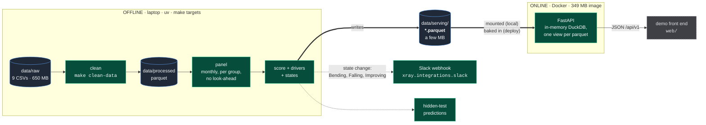
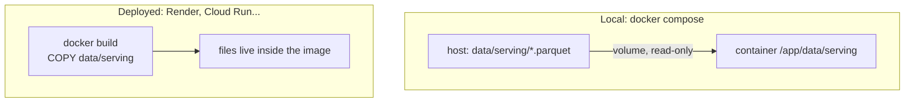
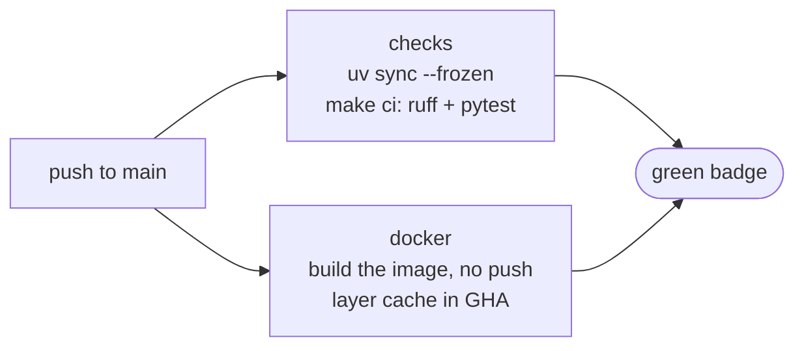

# Infrastructure

How data gets from nine CSVs to a container that answers the demo, and what runs where. The pipeline side (clean, panel, lake, why parquet and not a `.duckdb` file) is in [`architecture.md`](architecture.md); this file covers the serving side, configuration and CI.

**One idea holds it together:** heavy work happens offline, on a laptop, once. The online side only reads a small finished file. The 650 MB of raw data never leaves the machine; what gets served is a few MB of scores, drivers and alerts. That is why everything fits in free tiers and the demo cannot be slow.

## The flow



Green is built, dashed grey is still to come, blue is data at rest.

The contract between the two halves is **one folder**: `data/serving/*.parquet`. The pipeline owns writing it, the API only reads it, and each file becomes a table named after it. There is deliberately no `.duckdb` file: a DuckDB file held open by a writer locks out every reader, parquet does not (see `architecture.md` section 4). Whoever builds the score and whoever builds routes can work in parallel as long as they agree on those tables.

## What runs where

| Piece | Runs on | Started with | Needs |
|---|---|---|---|
| Pipeline (clean, panel, then score) | laptop with `uv`, or Docker | `make panel`, `make pipeline`, `make docker-pipeline` | `pipeline` dependency group (pandas, pyarrow, scikit-learn) |
| Score, alerts, serving tables | laptop with `uv`, or Docker | `make score`, `make monitor`, `make serve` | same |
| Hidden-test submission | laptop with `uv`, or Docker | `make submit RAW=path/to/csvs` | same |
| Live replay, month by month | laptop with `uv`, or Docker | `make replay [FROM=] [PAUSE=] [CHANNEL=]` | same, plus a running API for the web to follow |
| API, dev mode | laptop, `uv` | `make api` (auto-reload, docs at `/docs`) | core dependencies only |
| API, container | Docker, target `api` | `make api-up` / `make api-down` | Docker |
| Alerts | wherever the pipeline runs | `make slack-test` to try it | `XRAY_SLACK_WEBHOOK_URL` |
| CI | GitHub Actions | every push to `main` | nothing, no secrets |

## Local versus deployed

Same image in both cases. Only the origin of the parquet files changes.



- **Local**: compose mounts the host folder over the image's copy. Re-run the pipeline, restart the container, new scores. No rebuild.
- **Deploy**: run the pipeline, then build. The image carries its data, so the host needs no database, no volume and no secret to serve the demo. Redeploy to refresh scores.

The API also starts with no tables at all (`/health` then reports `"tables": []`), so the container is never blocked on the pipeline.

## Configuration

Everything is read by `src/xray/settings.py` with the `XRAY_` prefix. Precedence: real environment variable, then `.env`, then the default. Copy `.env.example` to `.env`; every variable is optional.

| Variable | Default | Purpose |
|---|---|---|
| `XRAY_ENV` | `local` | Shown by `/health`. The image sets `docker`. |
| `XRAY_LOG_LEVEL` | `INFO` | |
| `XRAY_PORT` | `8000` | Host port used by compose. |
| `XRAY_DATA_DIR` | `data/raw` | Raw CSV folder, pipeline only. |
| `XRAY_SERVING_DIR` | `data/serving` | The image pins it to `/app/data/serving`. |
| `XRAY_PROCESSED_DIR`, `XRAY_LAKE_DIR` | `data/processed`, `data/lake` | Pipeline only. |
| `XRAY_CORS_ORIGINS` | localhost 3000 and 5173 | JSON list. Add the front end URL once it exists. |
| `XRAY_SLACK_WEBHOOK_URL` | empty | Without it `send_slack` logs the alert and returns `False`. |

`.env` is git-ignored. `.env.example` is the only env file in git, and it holds no secrets.

## The images

One `Dockerfile`, two targets. `pipeline` is built with `make docker-build` (`--target pipeline`, documented in `architecture.md` section 10). `api` is the last stage, so it is what a plain `docker build .` produces: Render cannot pick a target and builds the last one. Compose builds it too, in two stages from the lockfile:

1. **builder**: installs dependencies (cached layer, rebuilt only when `uv.lock` changes), then the package.
2. **runtime**: `python:3.12-slim`, the virtualenv copied over, a non-root user, a `HEALTHCHECK` on `/health`, and `uvicorn` listening on `$PORT` (hosts inject it) or 8000.

The pipeline libraries live in the `pipeline` dependency group. Laptops install it by default (`[tool.uv] default-groups`), the image installs with `--no-default-groups`. Result: 349 MB instead of 1.02 GB. **An import of pandas inside `xray.api` will work on a laptop and crash in the container**: query DuckDB directly there.

`.dockerignore` excludes `data` except `data/serving`, so raw data cannot end up in an image by accident.

## CI



Both jobs run in parallel and use no secrets. There is no CD job: the API has `autoDeployTrigger: checksPass` in `render.yaml`, so Render deploys a push to `main` once these checks are green. The static site deploys on every push.

## Deploy: Render, free, no card

`render.yaml` at the repo root is a Blueprint with two services. In Render: New > Blueprint, pick the repo, apply.

| Service | What | Sleeps |
|---|---|---|
| `lighthouse` | static site, `web/` built with `npm ci && npm run build`, served from a CDN | never |
| `xray-api` | the `api` image, Frankfurt, health check on `/health` | after 15 min idle, about a minute to wake |

- The demo only needs the static site, which reads `web/public/data/*.json`. Those files are in git: after the serving tables or the agent cache change, run `make publish` (re-exports the JSON and stages what Render serves), then commit and push.
- `data/serving/context/*.json` (agent context cache) is in git for the same reason: a git build has no other way to get it.
- Only the Agents chat needs secrets: set `HELMCODE_API_KEY`, `EXA_API_KEY` and `TAVILY_API_KEY` on
  `xray-api` in the Render dashboard (`sync: false` in `render.yaml`). The static site gets the
  API address at build time through `VITE_API_URL`; locally it defaults to `http://localhost:8000`.
- Nothing else on the API needs secrets. If Render gives the site another hostname, update `XRAY_CORS_ORIGINS` in `render.yaml`.
- Before the pitch, open `/health` on the API to wake it, or point a free UptimeRobot monitor at it every 5 minutes.
- Fallback on stage: `make api-up` plus `cloudflared tunnel --url http://localhost:8000`.

## Observability

| What | Where to look |
|---|---|
| API errors, agent warnings, each chat request | Render, `xray-api`, **Logs** |
| A screen that broke in someone's browser | the same log: the page posts render errors, uncaught errors and rejected promises to `POST /api/v1/client-errors`, logged as `xray.client` with the URL and the component stack |
| What an agent did on a question | the Agents tab itself: every tool call is a step with input, output and time |
| Deploys | Render, each service, **Events**; CI in GitHub Actions |

The static site has no server and so no log of its own: without the client-errors route a broken
screen leaves no trace. If the API is asleep the report is lost, which is acceptable for a demo.

## Serving schema

`docs/serving-contract.md`. Written by `make serve` from the real score; `make web-data` re-exports it as JSON for the static front end.

## Running the demo live

The front end reads the API when one answers `/api/v1/version` and falls back to its baked JSON otherwise, so the deployed site works with no API and the same build goes live the moment an API is reachable. On stage, everything runs on the laptop:

```bash
make lighthouse [RAW_DIR=path/to/csvs]           # load, score, publish, then API :8000 and web :5173 together
make replay FROM=2025-01 PAUSE=8 CHANNEL=slack   # second terminal: a month lands every 8 s, alerts go to Slack
```

`make lighthouse` is `install`, `npm install` when `web/node_modules` is missing or stale, the pipeline up to the serving tables (skipping what is already built), the JSON export, then `make -j2 api web`: both processes in one terminal, Ctrl-C stops both. A server already answering on its port is reused rather than fought over (an API started with `make api` elsewhere re-reads the published tables on its own); a port held by something else fails fast with the process named, and `API_PORT=` / `WEB_PORT=` move either. `make lighthouse-down` stops whatever listens on both ports. Separately: `make api` (or `make api-up` in Docker) and `make web`.

Each month takes about two seconds to land, rebuild and publish; the web notices within three. `RESET=1` empties the lake and the alert ledger first, `CHECK=1` asserts every published month against `data/marts/scores.parquet`. Deployed API: `xray-api` bakes its tables and has no pipeline dependencies, so a live replay there would need a token-protected publish endpoint receiving the parquet files. Not built; the laptop plus `cloudflared tunnel` is the fallback.

### With names the room knows: `make demo`

```bash
make lighthouse                # as above, in one terminal
make demo FROM=2025-01 PAUSE=8 CHANNEL=slack   # in another
make serve                     # afterwards: put the real challenge tables back in data/serving
```

`make demo` generates a synthetic dump in the challenge's nine-CSV shape for 24 Spanish scale-ups (`src/xray/pipeline/synth.py`: Glovo, Cabify, Jobandtalent, Idealista, Wallbox, Factorial...), each with an archetype written into its trail only, then replays it **together with the challenge dump** as one portfolio, month by month exactly as above: the 250 challenge groups stay on screen and the 24 named ones join them (every id the generator mints carries a `SYN_` prefix, so nothing collides). Without CSVs in `RAW_DIR` the portfolio is the synthetic one alone. Nothing downstream is scripted: the real pipeline scores the files, and the story has to come out of the transactions, invoices and balances. Glovo is the brief's Velasco (about 81 to 69, bending alarm in month 15 while still in the coping tier), Cabify its Northbrook (56 to 80). Every figure is invented and the names are labels; say so on stage. The dump and its lake live under `data/demo/`, git-ignored, and `make demo` overwrites `data/serving`, hence `make serve` after.

