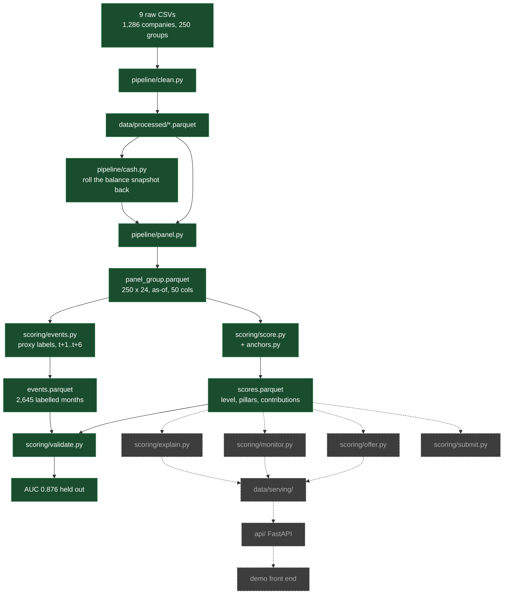

# Status

State of the system on 19 September 2026. Design lives in `health-score-research.md`, product in
`brief.md`. This file is only what is built, what is broken and what is next.

## Pipeline

Solid is built and running. Dashed is not written yet. `data/serving/` today holds invented tables
from `scoring/mock.py`, which the API reads so the product could be built before the score existed.

## Done

| Piece | State |
|---|---|
| Clean, cash reconstruction, monthly panel | 250 groups x 24 months, 50 columns, no look-ahead |
| Operating flows | `inflow_op`/`outflow_op`, 3m and 12m windows, `debt_service_12m` |
| Proxy labels | 2,645 labelled group-months, strictly forward-looking |
| Anchor table | 9 indicators, fixed breakpoints, calibrated then frozen |
| Level score | 4,114 scored group-months, additive contributions, cap rule |
| Validation | Discrimination, trajectory, stability, ablation, split by group |
| CI | lint, format, 64 tests, green |

**AUC 0.876** against forward negative cash on held-out groups; train 0.869, so nothing overfits
because nothing is fitted. Level quintiles run 38.2% to 1.9%.

Weights, set from measured discrimination rather than the opening guess: liquidity 0.35, payment
discipline 0.25, cash generation 0.15, collections 0.15, debt burden 0.10.

## Problems

1. **Level is too noisy.** Median month-on-month change 4.07 points, target under 3, p90 14.1.
   Blocks the monitor: a CUSUM on this fires on nothing but noise.
2. **Trend only works one way.** Within the middle of the level band, rising 1.7% vs falling 5.1%.
   Improvement is visible, deterioration is not. Question 3 of the six is unanswered.
3. **Invoice pillars cost accuracy.** Dropping payment discipline moves held-out AUC +0.024,
   collections +0.012. They pay for themselves in explanation, not prediction.
4. **Only one event is predictable.** `missed_payroll` scores AUC 0.600 and `inflow_collapse`
   0.413. Neither is readable from the financial trail; both are reported beside the score.
5. **Label risk.** `distress` was narrowed to `cash_negative` because that is what the data
   supports. One step from marking our own homework. The hidden-test metric may disagree.
6. **Short history.** 57 of 250 groups have under 9 months. They score fine on level; they cannot
   carry a CUSUM state.
7. **Serving tables are still invented.** The API and any UI read `mock.py` output, not `scores`.

## Next

In order, each with the check that closes it.

1. Smooth the level -> stability median under 3, then re-measure the trend.
2. Decide the invoice-pillar weights -> ablation stops showing a positive delta, or we accept it
   in writing and say why in the pitch.
3. `explain.py` -> per month, the pillars that moved and by how much, summing to the level change.
4. `monitor.py` -> CUSUM on the smoothed level, alert only on transitions, measured anticipation.
5. Wire `scores.parquet` into `data/serving/` -> the API serves real numbers, `mock.py` retires.
6. `submit.py` -> hidden-test predictions, once the format is known.

## Open

- Hidden-test format and leaderboard metric still unknown. Blocks step 6.
- `exchange_rate` direction, before summing a multi-currency group.
- `accounting_status = DISCARDED`, 308k rows: if rejected, they leave operating flow.

Full list in `brief.md` section 10.
