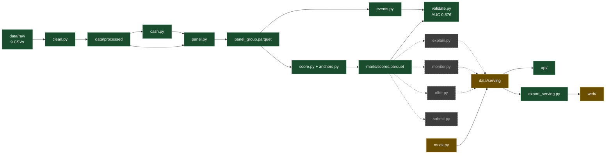

# Status

What is built, what is broken, what is next. Nothing else lives here: design is in
`health-score-research.md`, product in `brief.md`, system shape in `architecture.md`.

| | |
|---|---|
| As of | 2026-09-19, commit `5a13f0b` |
| Verified by | `make validate` and `make test` on that commit. Every number below comes from their output. |
| Re-verify | `make validate` (rebuilds `data/marts/` from `data/raw/`, about 1 minute) and `make ci` |
| Update rule | Change a row when its state changes. Keep the IDs (`P1`, `N1`, `Q1`) stable: commits and chats refer to them. |

State vocabulary, used in every table: `built` runs on the real dataset, `mock` runs on invented
data, `stub` exists but returns a placeholder, `todo` is not written.

## Where to look

| To do this | Read |
|---|---|
| Touch features, scoring, explanation or the monitor | `health-score-research.md` first, all of it |
| Join or aggregate raw data | `architecture.md` section 6 (traps) and section 5 (panel contract), `data/raw/data_dictionary.md` |
| Write a serving table or an API route | `serving-contract.md` |
| Work on an agent | `agents.md`, `architecture.md` section 8 |
| Understand the judging and the demo script | `brief.md` sections 6 and 7 |

## Components

| Component | Path | State | Output | Run |
|---|---|---|---|---|
| Clean | `src/xray/pipeline/clean.py` | built | `data/processed/*.parquet` | `make clean-data` |
| Cash reconstruction | `src/xray/pipeline/cash.py` | built | `data/marts/cash_monthly.parquet`, 30,384 rows | `make cash` |
| Monthly panel | `src/xray/pipeline/panel.py` | built | `data/marts/panel_group.parquet`, 250 groups x 24 months, 50 cols, as-of | `make panel` |
| Proxy labels | `src/xray/scoring/events.py` | built | `data/marts/events.parquet`, 2,645 group-months, labels look at t+1..t+6 | `make events` |
| Anchors | `src/xray/scoring/anchors.py` | built | 9 indicators, fixed breakpoints, frozen | |
| Level score | `src/xray/scoring/score.py` | built | `data/marts/scores.parquet`, 4,114 group-months, 38 cols, additive contributions, cap rule | `make score` |
| Validation | `src/xray/scoring/validate.py` | built | stdout report | `make validate` |
| Explanation | `src/xray/scoring/explain.py` | todo | | |
| Monitor | `src/xray/scoring/monitor.py` | todo | | |
| Offer | `src/xray/scoring/offer.py` | todo | | |
| Submission | `src/xray/scoring/submit.py` | todo | blocked by `Q1` | |
| Serving tables | `src/xray/scoring/mock.py` | mock | `data/serving/*.parquet`, 45 invented groups `DEMO_001`..`DEMO_045` | `make mock` |
| Serving export | `src/xray/pipeline/export_serving.py` | built | `web/public/data/*.json` | `make web-data` |
| API | `src/xray/api/` | built, health route only | DuckDB views over `data/serving/` | `make api` |
| Front end | `web/` | mock | reads static `/data/*.json`, not the API | `make web` |
| Agent: context retrieval | `src/xray/agents/context_retrieval.py` | built, cached | `data/serving/context/` | `make context NAME="Cabify"` |
| Agent: peers | `src/xray/agents/peers.py` | built | `data/serving/context/` | `make peers NAME="Cabify"` |
| Agent: macro | `src/xray/agents/macro.py` | stub | | |
| Agent: narrator | `src/xray/agents/narrator.py` | partial: ranks weak pillars, prose pass not wired | | |
| CI | `Makefile` | built | lint, format, 67 tests, green | `make ci` |

The gap that matters: everything from `scores.parquet` down to the screen is disconnected. The
real score stops at `data/marts/`; the API and the front end show `mock.py` output. Closing it is `N5`.

Green is built on real data, amber runs on invented data, dashed grey is not written.

## Metrics

From `make validate`. Split by group: 244 labelled groups, 73 held out (781 group-months).

| Metric | Value | Target | Verdict |
|---|---|---|---|
| AUC, level vs `cash_negative`, held out | 0.876 | | good |
| AUC, same, train | 0.868 | close to held out | good: nothing is fitted, so nothing overfits |
| AUC vs `distress`, held out | 0.745 | | driven by `cash_negative` |
| AUC vs `missed_payroll`, held out | 0.600 | | not predictable, see `P4` |
| AUC vs `inflow_collapse`, held out | 0.413 | | not predictable, see `P4` |
| Forward negative cash by level quintile, Q1 to Q5 | 38.2%, 20.5%, 1.3%, 0.6%, 1.9% | monotonic | good |
| Forward negative cash, rising vs falling trend, middle half of the level | 1.7% vs 5.1% | | improvement visible, see `P2` |
| Forward negative cash by trend bucket: falling, flat-, flat+, rising | 14.4%, 15.0%, 17.5%, 4.4% | | falling not separable from flat, see `P2` |
| Level change month on month, median | 4.08 points | under 3 | fails, see `P1` |
| Level change month on month, p90 | 14.14 points | | fails, see `P1` |
| Level, median | 60.6 | | |
| Months capped by the cap rule | 2.3% | | |
| Event base rates: `cash_negative`, `missed_payroll`, `inflow_collapse`, `distress` | 11.3%, 16.1%, 21.7%, 25.1% | | |

Ablation, held-out AUC vs `cash_negative` when one pillar is dropped:

| Pillar | Weight | AUC without it | Delta |
|---|---|---|---|
| liquidity | 0.35 | 0.523 | -0.353 |
| payment_discipline | 0.25 | 0.899 | +0.024 |
| cash_generation | 0.15 | 0.855 | -0.020 |
| collections | 0.15 | 0.887 | +0.012 |
| debt_burden | 0.10 | 0.849 | -0.027 |

Weights were set from measured discrimination, not from the opening guess.

## Problems

| ID | Problem | Evidence | Blocks | Closed by |
|---|---|---|---|---|
| P1 | Level is too noisy | median monthly change 4.08, target under 3, p90 14.14 | the monitor: a CUSUM on this level fires on noise | `N1` |
| P2 | Trend works one way only | falling 14.4% vs flat 15.0 to 17.5%: deterioration is not separable. Rising is (4.4%) | question 3 of the six, "who is starting to bend" | `N1`, then re-measure |
| P3 | Invoice pillars cost accuracy | dropping payment_discipline +0.024 AUC, collections +0.012 | nothing; they pay in explanation, not prediction | `N2` |
| P4 | Only one event is predictable | `missed_payroll` 0.600, `inflow_collapse` 0.413 | nothing; both are reported beside the score, not inside it | accepted |
| P5 | Label risk | `distress` was narrowed to `cash_negative` because that is what the data supports. Close to marking our own homework | the leaderboard may use another target | `Q1` |
| P6 | Short history | 57 of 250 groups have under 9 months | those groups score on level but cannot carry a CUSUM state | state `not_enough_data` in `N4` |
| P7 | Product shows invented data | `data/serving/` is `mock.py` output, 45 fake groups; the front end reads its JSON export | the demo | `N5` |

## Data traps

The dataset is hard to join and has holes. Each trap below is already handled; do not re-solve
it, and do not read the raw column directly. Detail and numbers: `architecture.md` section 6.

| Trap | Consequence if ignored | Handled in |
|---|---|---|
| `payment_date` equals `due_date` on about 97% of unpaid invoices | every overdue invoice scores as paid on time | `clean.py`: kept only when `status = 'paid'` |
| Invoice `status` and `pending_amount` are as of extraction, not as of the month | look-ahead leak | `panel.py`: open, overdue, settled derived from dates only |
| 2026-09 is a single day | every company collapses 94% in the last month | window ends at 2026-08 |
| Companies onboard across the window, 439 active to 1,229 | "onboarded recently" reads as "dying" | `is_covered`, `months_observed` on every panel row |
| 39% of companies have no invoices (785 of 1,286; 167 of 250 groups) | invoice pillars missing | `has_erp`; score reweights over available pillars, reports `coverage` |
| `balances.csv` is a final snapshot | using it in month t is a leak | `cash.py` rolls it back through transactions |
| `description` and `concept` hold commas and newlines | `wc`, `awk`, `cut` give wrong counts | parse with a real CSV reader |
| 3% of paid invoices are paid before issue, down to -2,139 days | one large one flips weighted DSO negative | `panel.py` drops them from the settled aggregate |
| 90.2% of transactions have no `counterparty_id` | no counterparty joins from transactions | not used |
| `category` is `-` on 25% of transactions | | normalised to `uncategorized` |
| No invoice direction column | | sign of `amount`: positive receivable, negative payable. Unconfirmed, see `Q4` |

Joins: `company_id` joins every file; `group_id` comes from `companies`. The scoring unit is the group.

## Next

In order. Each step is done when its check passes.

| ID | Step | Files | Done when | Depends on |
|---|---|---|---|---|
| N1 | Smooth the level | `scoring/score.py` | `make validate` stability median under 3, AUC not below 0.86; then re-read the trajectory block for `P2` | |
| N2 | Decide the invoice-pillar weights | `scoring/score.py`, `brief.md` section 10 | ablation delta is no longer positive, or the cost is accepted in writing with the pitch line | |
| N3 | Explanation | `scoring/explain.py` | per group-month, pillar deltas sum to the level change | `N1` |
| N4 | Monitor | `scoring/monitor.py` | CUSUM on the smoothed level, alerts only on state transitions, anticipation measured in months against `events.parquet` | `N1` |
| N5 | Real serving tables | writer for `data/serving/`, schema in `serving-contract.md` | `make web-data` passes its column checks on real groups; `mock.py` retires | `N3`, `N4` for `drivers` and `alerts`; `groups` and `scores` can land now |
| N6 | Submission | `scoring/submit.py` | predictions file in the organisers' format | `Q1` |

## Open questions

Ask the Embat engineers. Full list: `brief.md` section 10.

| ID | Question | Blocks |
|---|---|---|
| Q1 | Hidden-test format, target and leaderboard metric | `N6`, `P5` |
| Q2 | `exchange_rate` direction: multiply or divide. 4% of transactions are non-unit | summing a multi-currency group |
| Q3 | Meaning of `accounting_status = DISCARDED`, 308k rows | whether they leave operating flow |
| Q4 | Is invoice direction really the sign of `amount` | collections and payment_discipline pillars |
