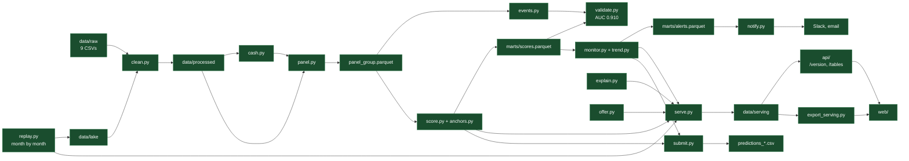

# Status

What is built, what is broken, what is next. Nothing else lives here: design is in
`health-score-research.md`, product in `brief.md`, system shape in `architecture.md`.

| | |
|---|---|
| As of | 2026-09-19, branch `feat/demo-synth` |
| Verified by | `make validate` and `make test` on that branch. Every number below comes from their output. |
| Re-verify | `make validate` (rebuilds `data/marts/` from `data/raw/`, about 1 minute) and `make ci` |
| Update rule | Change a row when its state changes. Keep the IDs (`P1`, `N1`, `Q1`) stable: commits and chats refer to them. |

State vocabulary, used in every table: `built` runs on the real dataset, `mock` runs on invented
data, `stub` exists but returns a placeholder, `todo` is not written.

## Where to look

| To do this | Read |
|---|---|
| Touch features, scoring, explanation or the monitor | `scoring.md` (what is built, every formula, how to change it), then `health-score-research.md` (why) |
| Join or aggregate raw data | `architecture.md` section 6 (traps) and section 5 (panel contract), `data/raw/data_dictionary.md` |
| Write a serving table or an API route | `serving-contract.md` |
| Work on an agent | `agents.md`, `architecture.md` section 8 |
| Understand the judging and the demo script | `brief.md` sections 6 and 7 |

## Components

| Component | Path | State | Output | Run |
|---|---|---|---|---|
| Clean | `src/xray/pipeline/clean.py` | built | `data/processed/*.parquet` | `make clean-data` |
| Cash reconstruction | `src/xray/pipeline/cash.py` | built | `data/marts/cash_monthly.parquet`, 30,384 rows | `make cash` |
| Monthly panel | `src/xray/pipeline/panel.py` | built | `data/marts/panel_group.parquet`, 250 groups x 24 months, 52 cols, as-of | `make panel` |
| Proxy labels | `src/xray/scoring/events.py` | built | `data/marts/events.parquet`, 2,645 group-months, labels look at t+1..t+6 | `make events` |
| Anchors | `src/xray/scoring/anchors.py` | built | 9 indicators, fixed breakpoints, frozen; weights 0.40 / 0.20 / 0.20 / 0.10 / 0.10 | |
| Level score | `src/xray/scoring/score.py` | built | `data/marts/scores.parquet`, 4,114 group-months, 38 cols, additive contributions, cap rule; every flow indicator a ratio of trailing sums; scores `panel_company` too with `key="company_id"` | `make score` |
| Validation | `src/xray/scoring/validate.py` | built | stdout report | `make validate` |
| Explanation | `src/xray/scoring/explain.py` | built | `drivers(scores)`: pillar, score, contribution, headline indicator, deltas; `indicator_drivers` one level down | via `make serve` |
| Trajectory maths | `src/xray/scoring/trend.py` | built | smoothing, Theil-Sen, CUSUM state machine, shared by the monitor and `mock.py` | |
| Monitor | `src/xray/scoring/monitor.py` | built | `data/marts/alerts.parquet` 343 rows, `trajectory.parquet` 4,114 rows | `make monitor` |
| Notifier | `src/xray/scoring/notify.py`, `src/xray/scoring/rules.py` | built | Slack or SMTP, ledger at `data/marts/_alerts_sent.json`; `CHANNEL=rules` routes each alert by urgency (`info`, `warning`, `critical`), severity and group through the rule book at `data/serving/alert_rules.json`, written from the chat (`notifier` agent) or `POST /api/v1/alert-rules` | `make alerts`, `make notify [CHANNEL=rules]` |
| Offer | `src/xray/scoring/offer.py` | built | `offers`: limit 0.2x to 1.5x monthly inflow and APR 12.5% to 4.5% from `compound`, none under 40; `actions`: three per group, weakest pillar first | via `make serve` |
| Submission | `src/xray/scoring/submit.py` | built, format open | clean, cash, panel, level, trajectory over any CSV directory in a scratch dir; `predictions_groups.csv` and `predictions_companies.csv`, long form. Reshape once `Q1` lands | `make submit RAW=dir` |
| Serving tables | `src/xray/scoring/serve.py` | built | `data/serving/*.parquet` from the real score: 250 groups, 1,286 companies, 4,114 scores, 16,485 drivers, 343 alerts, 4,114 offers, 749 actions. `mock.py` still runs for archetypes but is no longer what the demo reads | `make serve` |
| Serving export | `src/xray/pipeline/export_serving.py` | built | `web/public/data/*.json`, the static fallback | `make web-data` |
| Publish | `src/xray/scoring/serve.py::publish` | built | tables swapped into `data/serving` through `.next/`, `_version.json` stamped last | `make serve` |
| Synthetic demo dump | `src/xray/pipeline/synth.py` | built | 24 named Spanish scale-ups with an archetype each, in the nine-CSV shape, under `data/demo/raw`; the real pipeline scores it | `make demo-data` |
| Onboarding | `src/xray/pipeline/onboard.py` | built | today's portfolio goes live first, complete; then the named groups connect to it in batches, each scored on the spot with its whole history and published; nobody already there moves. About 1 s a batch | `make demo [BATCHES=2] [GAP=20] [CHANNEL=slack]` |
| Replay | `src/xray/pipeline/replay.py` | built | one month at a time: land in the lake, rebuild as-of, publish, notify. About 2 s a month. `CHECK=1` proves each month equals the full run | `make replay` |
| API | `src/xray/api/` | built: health, version, tables, alerts, chat | DuckDB views over `data/serving/`, re-read on every query, re-registered on `/version` | `make api` |
| Front end | `web/` | built | reads the API when it answers (`live` badge, polls `/version` every 3 s, follows new months), else the static JSON | `make web` |
| Agent: context retrieval | `src/xray/agents/context_retrieval.py` | built, cached | `data/serving/context/` | `make context NAME="Cabify"` |
| Agent: peers | `src/xray/agents/peers.py` | built | `data/serving/context/` | `make peers NAME="Cabify"` |
| Agent: macro | `src/xray/agents/macro.py` | stub | | |
| Agent: narrator | `src/xray/agents/narrator.py` | partial: ranks weak pillars, prose pass not wired | | |
| CI | `Makefile` | built | lint, format, 147 tests, green | `make ci` |

Real score end to end, and live: `make lighthouse` brings data, API and web up in one command;
`make replay` beside it shows the portfolio move month by month with alerts landing as they
would have, and `make demo` shows named companies connecting to it and being scored on the spot. `groups.name` is the `group_id` because
the dataset has no trading names (Q9).

Everything runs on real data.

## Metrics

From `make validate`. Split by group: 244 labelled groups, 73 held out (781 group-months).

| Metric | Value | Target | Verdict |
|---|---|---|---|
| AUC, level vs `cash_negative`, held out | 0.910 | | good |
| AUC, same, train | 0.878 | close to held out | good: nothing is fitted, so nothing overfits |
| AUC vs `distress`, held out | 0.755 | | driven by `cash_negative` |
| AUC vs `missed_payroll`, held out | 0.593 | | not predictable, see `P4` |
| AUC vs `inflow_collapse`, held out | 0.392 | | not predictable, see `P4` |
| Forward negative cash by level quintile, Q1 to Q5 | 51.6%, 7.1%, 1.3%, 1.9%, 0.6% | monotonic | good |
| Forward negative cash, rising vs falling trend, middle half of the level | 3.4% vs 2.3% | | the trend is not a second predictor, see `P2` |
| Forward negative cash by trend bucket: falling and rising | 11.9%, 5.6% | | see `P2` |
| Level change month on month, median | 2.45 points | under 3 | good |
| Level change month on month, p90 | 9.27 points | | one-month jumps remain, which is what the monitor's jump detector is for |
| Level, median | 63.2 | | |
| Months capped by the cap rule | 0.9% | | |
| Event base rates: `cash_negative`, `missed_payroll`, `inflow_collapse`, `distress` | 10.0%, 16.1%, 20.8%, 24.1% | | |
| Scored alone vs inside the portfolio, 70 groups cut from the raw CSVs | 0 of 1,074 group-months differ | identical | good: nothing is fitted |
| Anticipation, 11 groups first negative after 6 clean months | smoothed level 5 points under its peak a median 7 months before; CUSUM alarm 6 months before, on 73% | | judging block two |

Ablation, held-out AUC vs `cash_negative` when one pillar is dropped:

| Pillar | Weight | AUC without it | Delta |
|---|---|---|---|
| liquidity | 0.40 | 0.549 | -0.362 |
| payment_discipline | 0.20 | 0.927 | +0.017 |
| cash_generation | 0.20 | 0.913 | +0.002 |
| collections | 0.10 | 0.929 | +0.018 |
| debt_burden | 0.10 | 0.903 | -0.008 |

Weights were set from measured discrimination, not from the opening guess. On this one ruler
the level would be better as liquidity plus debt; the other three pillars are kept because the
product has to explain a number, not only rank a liquidity event, and the hidden metric is
unknown (`Q1`).

Indicator design, all measured on the same events (details in `brief.md` section 9): margin over
6 months and lateness over 3 as ratios of sums, growth as 3-month run rate over the trailing 12,
overdue capped at 90 days past due and divided by paid flow instead of the open book, buffer
denominator a 3-month mean of monthly operating outflow, every indicator available from a group's
first month so no pillar joins late. Together: stability 4.07 to 2.45, held-out AUC 0.876 to
0.910 (with every amount in euros at the yearly rate).

## Monitor

From `make monitor` on the same marts. 343 alerts over 4,114 group-months, 8.3%, on 191 of the
250 groups: around 18 a month across the portfolio, ranked by the size of the move weighted by
the group's inflow percentile. Two detectors, because a spike and a slide are different
questions.

| Metric | Value | Target | Verdict |
|---|---|---|---|
| Alert rate | 8.3% of group-months | a few percent, not 30 | acceptable: 18 a month on 250 groups |
| Jumps | 90: one month of the raw level past `max(10 points, 3 sigma)` of the group's own swing | | fires with no delay, published provisional |
| Shifts | 253: CUSUM on the smoothed level entering an alarm | | only on moves that held |
| Direction | 168 down, 175 up | both | improvement is a first-class alert |
| Bump vs structural | of the jumps, 74 sustained, 4 reverted within two months, 12 open | | question 4 of the six, answered in the feed |
| Anticipation | 50% of alerts land before the tier next moves, median 3 months ahead | | judging block two |
| Late alerts | 51%: the tier had already moved between onset and confirmation | | fails, see `P9` |
| Fast lane | 19% of down shifts had a down jump first, median 3 months earlier | | the jump buys 3 months on a fifth of the slides |
| Stability of the smoothed level | median monthly change 2.1 points, from 4.08 raw | under 3 | good, at the cost of about 1.5 months of lag |

The monitor smooths the level itself (causal EWMA, alpha 0.4) inside `trend.py`, because `P1` is
not fixed yet. When `N1` lands, raise the alpha and the alarms arrive earlier.

## Problems

| ID | Problem | Evidence | Blocks | Closed by |
|---|---|---|---|---|
| P1 | Level is too noisy | closed: median monthly change 2.45, p90 9.27. The monitor still smooths at alpha 0.4 and can now move towards 1 (`N4`) | | closed by `N1` |
| P2 | Trend is not a second predictor of liquidity events | on the raw level a falling 6-month slope mean-reverts (corr with the next 6 months' level change -0.2); with EWMA 0.3 it is weakly persistent (+0.19 at 3 months). `level + k * trend` forecasts the level 4 months out worse than the level alone for any k | nothing, but it fixes the pitch: direction is what the group is doing, measured and explained, not a forecast. Anticipation is measured on the level series | accepted, same finding as `P8` |
| P3 | Invoice pillars cost accuracy | dropping payment_discipline +0.017 AUC, collections +0.018, cash_generation +0.002 | nothing; they pay in explanation, not prediction. Accepted in writing in `brief.md` section 9 | closed by `N2` |
| P4 | Only one event is predictable | `missed_payroll` 0.600, `inflow_collapse` 0.413 | nothing; both are reported beside the score, not inside it | accepted |
| P5 | Label risk | `distress` was narrowed to `cash_negative` because that is what the data supports. Close to marking our own homework | the leaderboard may use another target | `Q1` |
| P6 | Short history | 57 of 250 groups have under 9 months | those groups score on level but cannot carry a CUSUM state | state `not_enough_data` in `N4` |
| P7 | Groups have no trading names | `groups.name = group_id`; the dataset carries none | the demo reads `GROUP_0220` where the pitch says Velasco | `brief.md` Q9 |
| P10 | Live replay is local only | the deployed API bakes its tables and has no pipeline dependencies, so `make replay` cannot move the Render site | nothing for the stage: laptop plus tunnel | a token-protected publish endpoint, if wanted |
| P8 | An alert adds no forward-risk discrimination over the level | inside a level band, a down alert does not raise the odds of forward negative cash: 10.7% against a 16.4% base in the 40-55 band, 0 of 39 against 3.0% in 55-70 | nothing, but it sets the pitch: the monitor is attention and explanation, not a second predictor. Same finding as `P2` from the other side | accepted |
| P9 | Half the alerts are late | 51% fire after the tier had already moved once during the slide. The CUSUM plus the smoothing costs months the tier boundary does not wait for | the anticipation claim, which holds for the other half | `N1`, then retune the alarm |

## Data traps

The dataset is hard to join and has holes. Each trap below is already handled; do not re-solve
it, and do not read the raw column directly. Detail and numbers: `architecture.md` section 6.

| Trap | Consequence if ignored | Handled in |
|---|---|---|
| `payment_date` equals `due_date` on about 97% of unpaid invoices | every overdue invoice scores as paid on time | `clean.py`: kept only when `status = 'paid'` |
| Invoice `status` and `pending_amount` are as of extraction, not as of the month | look-ahead leak | `panel.py`: open, overdue, settled derived from dates only |
| 2026-09 is a single day | every company collapses 94% in the last month | window ends at 2026-08 |
| Companies onboard across the window, 439 active to 1,229 | "onboarded recently" reads as "dying" | `is_covered`, `months_observed` on every panel row |
| 39% of companies have no invoices (785 of 1,286; 167 of 250 groups) | invoice pillars missing | `has_erp`; score reweights over available pillars, reports `coverage` |
| `balances.csv` is a final snapshot | using it in month t is a leak | `cash.py` rolls it back through transactions |
| `description` and `concept` hold commas and newlines | `wc`, `awk`, `cut` give wrong counts | parse with a real CSV reader |
| 3% of paid invoices are paid before issue, down to -2,139 days | one large one flips weighted DSO negative | `panel.py` drops them from the settled aggregate |
| 90.2% of transactions have no `counterparty_id` | no counterparty joins from transactions | not used |
| `category` is `-` on 25% of transactions | | normalised to `uncategorized` |
| No invoice direction column | | sign of `amount`: positive receivable, negative payable. Unconfirmed, see `Q4` |

Joins: `company_id` joins every file; `group_id` comes from `companies`. The scoring unit is the group.

## Next

In order. Each step is done when its check passes.

| ID | Step | Files | Done when | Depends on |
|---|---|---|---|---|
| N1 | Smooth the level | done: stability 2.45, held-out AUC 0.910 | | |
| N2 | Decide the invoice-pillar weights | done: 0.20 and 0.10, cost accepted in `brief.md` section 9 | | |
| N3 | Explanation | done: `tests/scoring/test_explain_offer.py` holds that pillar deltas sum to the level change | | |
| N4 | Retune the monitor on the calmer level | `scoring/trend.py`, `scoring/monitor.py` | alpha raised from 0.4, late share under 51% at the same alert rate, anticipation re-measured | |
| N5 | Real serving tables | done: `make serve`. Left: `make web-data` on them, and the front end reads `name = group_id` until Q9 is decided | | |
| N6 | Submission | `scoring/submit.py` | done in long form (`make submit RAW=dir`); reshape to the organisers' format when it lands | `Q1` |
| N7 | Re-export the front end data | done: the demo opens on `GROUP_0220` with real curves, drivers, alerts and offers, live from the API or from the static export | | |
| N8 | Rehearse the live demo | `make api`, `make web`, `make replay FROM=2025-01 PAUSE=8 CHANNEL=slack` | the room watches June 2025 land and `GROUP_0220 is bending: 82.3` arrive in Slack; Slack webhook set in `.env` | |

## Open questions

Ask the Embat engineers. Full list: `brief.md` section 10.

| ID | Question | Blocks |
|---|---|---|
| Q1 | Hidden-test format, target and leaderboard metric | `N6`, `P5` |
| Q2 | `exchange_rate` direction: multiply or divide. 4% of transactions are non-unit | summing a multi-currency group |
| Q3 | Meaning of `accounting_status = DISCARDED`, 308k rows | whether they leave operating flow |
| Q4 | Is invoice direction really the sign of `amount` | collections and payment_discipline pillars |
