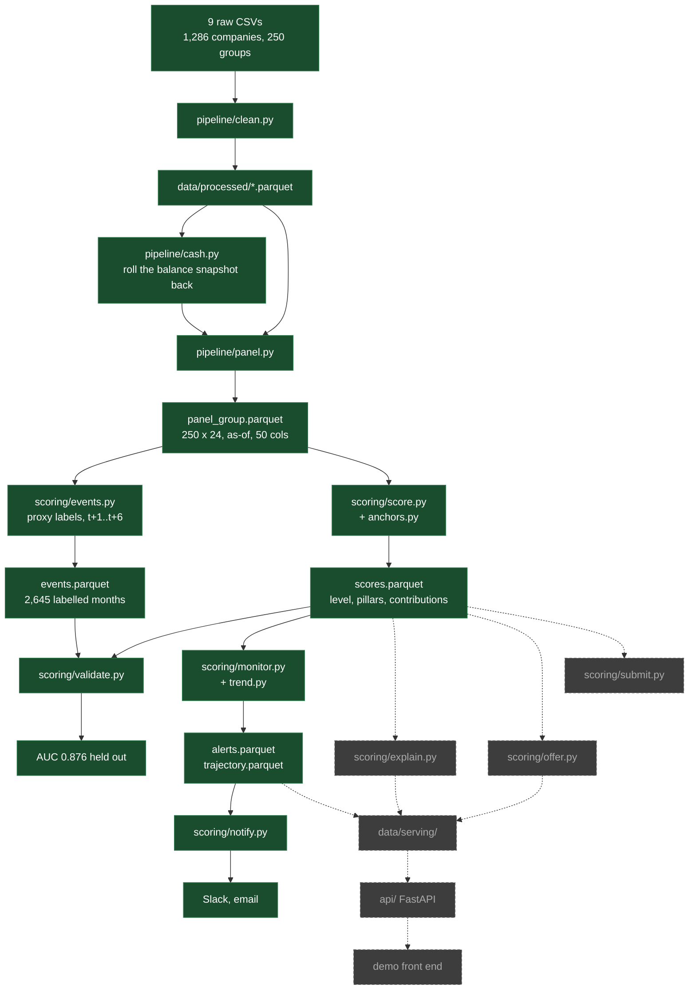

# Status

State of the system on 19 September 2026. Design lives in `health-score-research.md`, product in
`brief.md`. This file is only what is built, what is broken and what is next.

## Pipeline

Solid is built and running. Dashed is not written yet. `data/serving/` today holds invented tables
from `scoring/mock.py`, which the API reads so the product could be built before the score existed.

## Done

| Piece | State |
|---|---|
| Clean, cash reconstruction, monthly panel | 250 groups x 24 months, 50 columns, no look-ahead |
| Operating flows | `inflow_op`/`outflow_op`, 3m and 12m windows, `debt_service_12m` |
| Proxy labels | 2,645 labelled group-months, strictly forward-looking |
| Anchor table | 9 indicators, fixed breakpoints, calibrated then frozen |
| Level score | 4,114 scored group-months, additive contributions, cap rule |
| Validation | Discrimination, trajectory, stability, ablation, split by group |
| Monitor | Jump and shift detectors over the score, 343 alerts, both directions |
| Notifier | Alerts as deterministic messages, sent once, Slack or SMTP |
| Alerts API | `/api/v1/alerts` and `/api/v1/groups/{id}/alerts` |
| CI | lint, format, 88 tests, green |

**AUC 0.876** against forward negative cash on held-out groups; train 0.869, so nothing overfits
because nothing is fitted. Level quintiles run 38.2% to 1.9%.

Weights, set from measured discrimination rather than the opening guess: liquidity 0.35, payment
discipline 0.25, cash generation 0.15, collections 0.15, debt burden 0.10.

## Monitor

343 alerts over 4,114 group-months, 8.3%, on 191 of the 250 groups. Around 18 a month across the
whole portfolio, ranked by the size of the move weighted by the group's inflow percentile.
Measured against the score as of this build; the anchors and the panel are still moving, so
re-read these after any change to either.

| | |
|---|---|
| Jumps | 90: one month of the raw level moving past `max(10 points, 3 sigma)` of the group's own swing |
| Shifts | 253: a CUSUM on the smoothed level entering a down or an up alarm |
| Both directions | 168 down, 175 up. Improvement is a first-class alert |
| Bump vs structural | Of the jumps, 74 sustained, 4 reverted within two months, 12 still open |
| Anticipation | 50% of alerts land before the tier next moves, median 3 months ahead |
| Fast lane | 12% of down shifts had a down jump first, median 3 months earlier |

The level is smoothed with a causal EWMA (alpha 0.4) inside `trend.py` before anything is
measured on it, which takes the median month-on-month move from 4.07 points to 2.1, under the
stability target. It costs roughly 1.5 months of lag; when `score.py` smooths the level itself,
raise the alpha and the alarms arrive earlier.

## Problems

1. **Level is too noisy.** Median month-on-month change 4.07 points, target under 3, p90 14.1.
   Worked around inside the monitor rather than fixed: see above.
2. **Trend only works one way.** Within the middle of the level band, rising 1.7% vs falling 5.1%.
   Improvement is visible, deterioration is not. Question 3 of the six is unanswered.
3. **Invoice pillars cost accuracy.** Dropping payment discipline moves held-out AUC +0.024,
   collections +0.012. They pay for themselves in explanation, not prediction.
4. **Only one event is predictable.** `missed_payroll` scores AUC 0.600 and `inflow_collapse`
   0.413. Neither is readable from the financial trail; both are reported beside the score.
5. **Label risk.** `distress` was narrowed to `cash_negative` because that is what the data
   supports. One step from marking our own homework. The hidden-test metric may disagree.
6. **Short history.** 57 of 250 groups have under 9 months. They score fine on level; they cannot
   carry a CUSUM state.
7. **An alert adds no forward-risk discrimination over the level.** Inside a level band, months
   with a down alert are no likelier to be followed by negative cash than months without one:
   in the 40-55 band 10.7% against a 16.4% base, in 55-70 zero of 39 against a 3.0% base. The
   level predicts, the move does not. So the monitor is sold as attention and explanation,
   measured by anticipation of the tier change and by bump-vs-structural accuracy, not as a
   second predictor. Problem 2 is the same finding from the other side.
8. **51% of alerts are late.** The tier had already moved once between onset and confirmation.
   The CUSUM plus the smoothing costs months the tier boundary does not wait for.
9. **Serving tables are still invented.** The API and any UI read `mock.py` output, not `scores`.
   The alerts route already serves the real schema, because `mock.py` now runs the real
   detector over its invented scores.

## Next

In order, each with the check that closes it.

1. Smooth the level -> stability median under 3, then re-measure the trend.
2. Decide the invoice-pillar weights -> ablation stops showing a positive delta, or we accept it
   in writing and say why in the pitch.
3. `explain.py` -> per month, the pillars that moved and by how much, summing to the level change.
4. Wire `scores.parquet`, `trajectory.parquet` and `alerts.parquet` into `data/serving/` -> the
   API serves real numbers, `mock.py` retires.
5. `submit.py` -> hidden-test predictions, once the format is known.

## Open

- Hidden-test format and leaderboard metric still unknown. Blocks step 5.
- `exchange_rate` direction, before summing a multi-currency group.
- `accounting_status = DISCARDED`, 308k rows: if rejected, they leave operating flow.

Full list in `brief.md` section 10.
